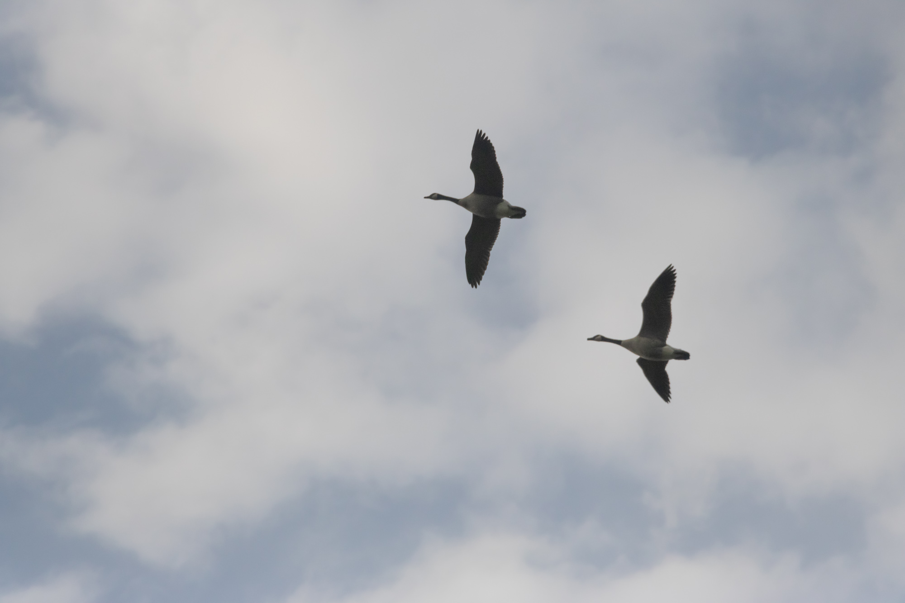

***Site still under construction for Biology: What Engineers Need To Know and Why, a course at Olin College.***

# SEASONAL CHANGES IN PARCEL B

This website represents a summary and documentation for my research project documenting seasonal changes in Parcel B, the forest adjoining Olin College of Engineering in Needham, Massachusetts. I used a combination of several cameras to document changes as I observed them on regular walks through the forest, and took notes regarding the changes I observed. I researched the changes and built a [bibliography](#) of research relevant to the changing phenomena I observed. Here, find the images I captured, each with a summary explanation of the relevant literature review findings.

    

    

*Made with ❤️ and 📸 at [Olin College](https://www.olin.edu) in Needham, Massachusetts.*
