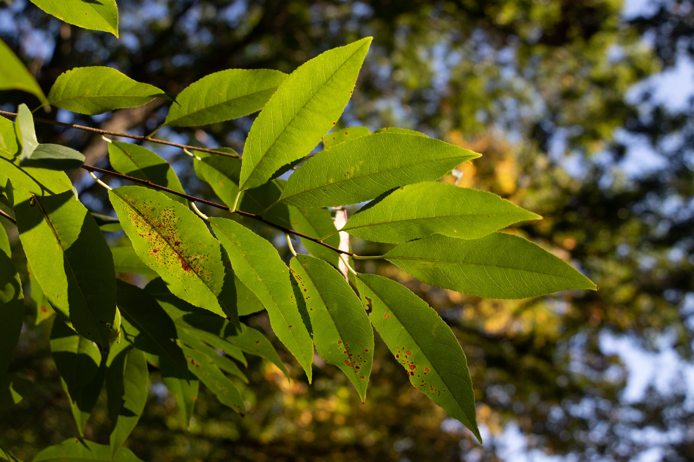

# SEASONAL CHANGES IN PARCEL B

This website represents a summary and documentation for my research project documenting seasonal changes in Parcel B, the forest adjoining Olin College of Engineering in Needham, Massachusetts. I used a combination of several cameras to document changes as I observed them on regular walks through the forest, and took notes regarding the changes I observed. I researched the changes and built a [bibliography](bibliography.md) of research relevant to the changing phenomena I observed. Here, find the images I captured, each with a summary explanation of the relevant literature review findings.

*Made with ❤️ and 📸 by [Sam](https://sam.daitzman.com) at [Olin College](https://www.olin.edu) in Needham, Massachusetts.*

A log disintegrating, with peeled-off bark. Wood deterioration is caused by a variety of biological processes, accelerated by enzymes and by interactions with bacteria, fungi and insects.

A fungus growing from a living birch tree. This is very likely a Birch Polypore (Piptoporus betulinus), which is known for fascinating properties like its ability to treat wounds. According to some research, it can act as a valuable enzyme reservoir and provide substances like cell wall glucans, which can induce a breakdown of some thin bacteria colonies (biofilms) responsible for tooth decay. This birch conk is similar to the one found in the pouch of Öetzi, an ice man who may have used it to treat intestinal parasites. It can be used to treat infections if sliced thin and placed on a wound.

Cattails (Typha sp.) with fruiting bodies displayed. Cattails are a monocotyledonous plant that grows alongside various bodies of water, often along wastewater areas. It can act as an important chemical reservoir in these ecosystems by uptaking some heavy metals. Cattails store most of these heavy metals below ground in their roots, which means that their upper sections can be harvested and used as insulation for homes. Each hectare can annually produce enough cattail materials to insulate up to three houses.

Open space along the pond in Parcel B. Over the last 12,000 years, vegetation and climate have varied significantly in Massachusetts. In one area nearby, scientists at the Center for Climatic Research observed a continuous history of different species of pine trees. "A Picea-Hudsonia parkland and then a Picea-Pinus banksiana-Alnus crispa boreal forest association grew near the site between 12,000 and 10,000 yr B.P. This vegetation was replaced by a northern conifer forest of Pinus strobus-P. banksiana, and, subsequently, by a more mesophytic forest (Pinus strobus, Tsuga, Quercus, Fagus, Acer, Urnus, Fraxinus, Ostrya) as the climate became warmer and wetter by 9500 yr B.P. By 9000 yr B.P. a Pinus rigida-Quercus association dominated the landscape. High charcoal frequencies from this and subsequent levels suggest that the pine barrens association developed during a warmer and drier climate that lasted from 9000 to about 5000 yr B.P. Increased percentages of Pinus strobus pollen indicate a return to moister and cooler conditions by about 3500 yr B.P. A doubled sedimentation rate, increased charcoal, and increased herb pollen suggest land disturbance near the pond before European settlement. These results suggest a rapid warming in the northeast in the early Holocene and support a hypothesis of a rapid sea level rise at that time." Evidence of past climate changes, and the significant impact they had on the ecosystems that surround us, are important evidence that modern (human-made) climate change could have similarly major effects on current species, like us.

Ripe bright red berries covered in dew. This may be a Pyracantha coccinea 'Red Cushion' (Scarlet Firethorn), which is hardy to around -23˚ Celsius.

A pumpkin (C. Pepo) rotting on a stake as it is decomposed by bacteria. The surface of pumpkin rinds contains at least one powerful antifungal protein capable of inhibiting growth of a wide variety of fungi (Botrytis cinerea, Colletotrichum coccodes, Fusarium solani, Fusarium oxysporum, and Trichoderma harzianum) in experiments, but eventually some mold spores are still able to germinate and destroy the fruit.

A leaf with bright backlight

Autumn olives surrounded by leaves

Autumn olives glowing red in sunlight

Dewy weed leaves

Dewy spiderweb in grass

Dewy grass with fruiting bodies

A small daisy-like flower in grass with dew

A chickadee in a crab-apple tree branch

An oak leaf, turning from green to red, against the blue sky

Bittersweet vine leaves hanging

Bumblebee at a flower

A small purple aster flower

A frog floating in water

Rose hips against a blurry background of more rose hips

Closeup of rose hips

Geese flying through the air

A single red-yellow poplar leaf on the ground

A rotting pumpkin showing progression of deterioration

Moss poking up through pine needles

Birch tree leaves deteriorating to yellow with brown flecks

A small chipmunk on a branch

A blue heron looking out over the water

A blue heron flying over water

A blue heron looking out at water, filled with a school of orange fish

A small native green bee at a white aster

A red dragonfly on a low spiky viney plant

A frog floating in water

A water insect swimming

A small dewy spiderweb in grass and small plants

A tiny brown grasshopper with stubby antennae sitting on a small leaf

A medium-size brown-and-green grasshopper with long antennae, one missing, sitting on a small leaf

A vibrant yellow leaf with green speckles still remaining and a heart shape cut out by a leaf-eating animal

Oak leaves with a sunny background

Pine needles covered in snow

Leaves with a blurry background

Crab apples, beginning to deteriorate, with snow in the background

Copyright 2020. All rights reserved. [Colophon](colophon.md). Take care.

    