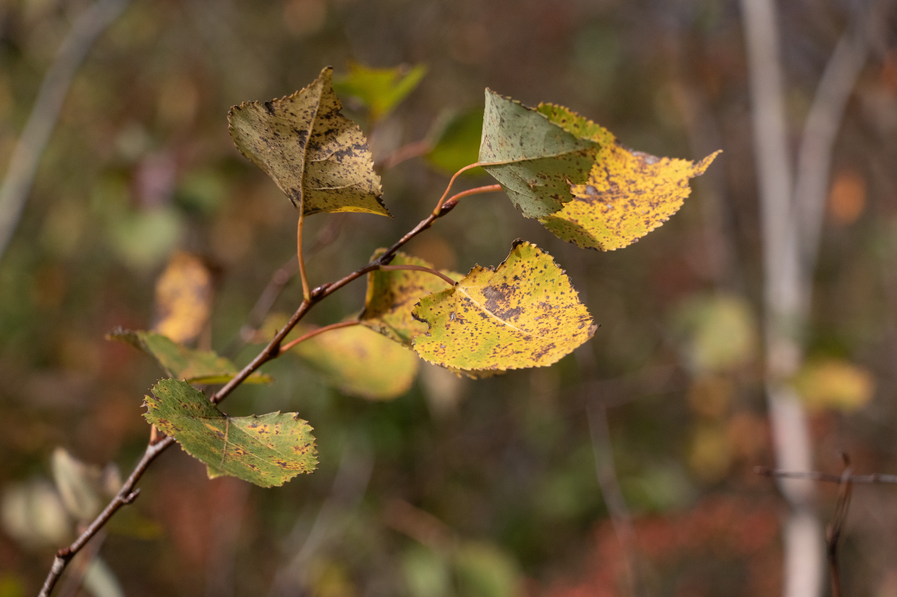

# SEASONAL CHANGES IN PARCEL B

This website represents a summary and documentation for my research project documenting seasonal changes in Parcel B, the forest adjoining Olin College of Engineering in Needham, Massachusetts. I used a combination of several cameras to document changes as I observed them on regular walks through the forest, and took notes regarding the changes I observed. I researched the changes and built a [bibliography](#) of research relevant to the changing phenomena I observed. Here, find the images I captured, each with a summary explanation of the relevant literature review findings.

   

Some text next to the first image. This is some more text. Some text next to the first image. This is some more text. Some text next to the first image. This is some more text. Some text next to the first image. This is some more text. Some text next to the first image. This is some more text. 

In Seasonal Changes in White Pine Leaves: A Comparison of Cold Resistance and Free-Sugar Fluctuations, Parker examines the effects of variations in extreme cold temperature on pine needle samples taken from Eastern white pine trees (the same variety I’ve found on Olin’s campus). Two stands of trees were used to collect samples. Three trees in each location were sampled periodically, with branches and terminal shoots taken for analysis. The pine needles, branches and shoots were stored in flasks, and the scientists gradually lowered the temperature and analyzed the plants’ reactions.

After this process, the scientists used chromatography to discern changes in sugars. The scientists found a “nearly constant level of cold resistance” from the group of Branford pines sampled between May and August, but found that the cold-hardiness increased significantly as the climate cooled. Some of the samples, in reaction to cooling temperature in the fall and winter, developed a remarkable level of cold resistance, with leaf samples surviving down to as cold as -78˚ C.

Sucrose levels were not connected (or, only very slightly changed) in accordance to changes in hardiness, but it appeared that raffinose levels increased in autumn, closely aligning with the increase in cold-hardiness. The researchers believe that the quantity of raffinose sampled from Eastern White Pine leaves is highly predictive of their cold-hardiness, both across different tree stands and within individual trees as they react to seasonal changes.

    

*Made with ❤️ and 📸 at [Olin College](https://www.olin.edu) in Needham, Massachusetts.*
