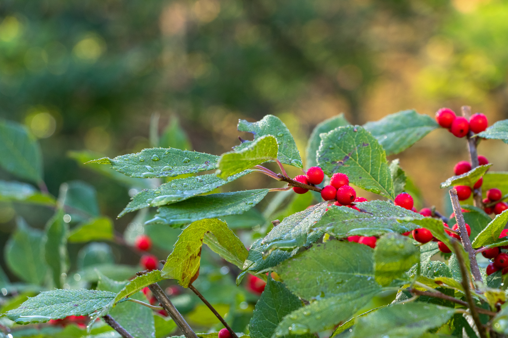
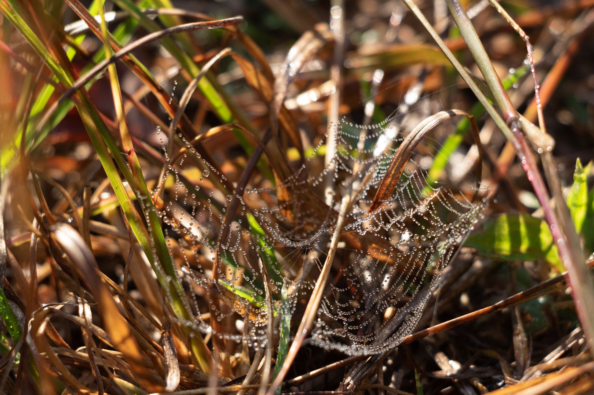

# SEASONAL CHANGES IN PARCEL B

This website represents a summary and documentation for my research project documenting seasonal changes in Parcel B, the forest adjoining Olin College of Engineering in Needham, Massachusetts. I used a combination of several cameras to document changes as I observed them on regular walks through the forest, and took notes regarding the changes I observed. I researched the changes and built a [bibliography](bibliography.md) of research relevant to the changing phenomena I observed. Here, find the images I captured, each with a summary explanation of the relevant literature review findings.

*Made with ❤️ and 📸 by [Sam](https://sam.daitzman.com) at [Olin College](https://www.olin.edu) in Needham, Massachusetts.*

A log disintegrating, with peeled-off bark. Wood deterioration is caused by a variety of biological processes, accelerated by enzymes and by interactions with bacteria, fungi and insects. ^[A footnote about wooood]

A mushroom growing from a living birch tree

Cattails with fruiting bodies displayed

Open space along the pond in Parcel B

Ripe bright red berries covered in dew

A pumpkin rotting on a stake

A leaf with bright backlight

Autumn olives surrounded by leaves

Autumn olives glowing red in sunlight

Dewy weed leaves

Dewy spiderweb in grass

Dewy grass with fruiting bodies

A small daisy-like flower in grass with dew

A chickadee in a crab-apple tree branch

An oak leaf, turning from green to red, against the blue sky

Bittersweet vine leaves hanging

Bumblebee at a flower

A small purple aster flower

A frog floating in water

Rose hips against a blurry background of more rose hips

Closeup of rose hips

Geese flying through the air

A single red-yellow poplar leaf on the ground

A rotting pumpkin showing progression of deterioration

Moss poking up through pine needles

Birch tree leaves deteriorating to yellow with brown flecks

A small chipmunk on a branch

A blue heron looking out over the water

A blue heron flying over water

A blue heron looking out at water, filled with a school of orange fish

A small native green bee at a white aster

A red dragonfly on a low spiky viney plant

A frog floating in water

A water insect swimming

A small dewy spiderweb in grass and small plants

A tiny brown grasshopper with stubby antennae sitting on a small leaf

A medium-size brown-and-green grasshopper with long antennae, one missing, sitting on a small leaf

A vibrant yellow leaf with green speckles still remaining and a heart shape cut out by a leaf-eating animal

Oak leaves with a sunny background

Pine needles covered in snow

Leaves with a blurry background

Crab apples, beginning to deteriorate, with snow in the background

Copyright 2020. All rights reserved. [Colophon](colophon.md). Take care.

    